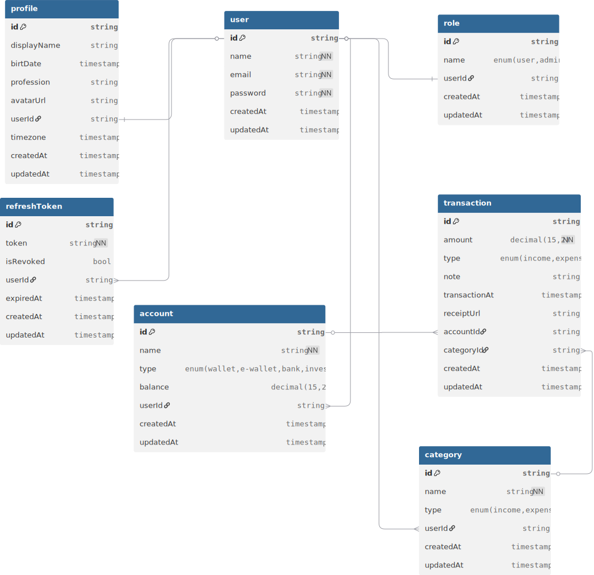

# WealhyMe Project

### By **MerthaSant.dev**

---

### Pendahuluan

Proyek Wealthy Me bermula dari kebutuhan akan sistem pengelolaan keuangan yang lebih personal dan intuitif. Berbeda dengan aplikasi mainstream yang terasa kaku, Wealthy Me dirancang untuk menyesuaikan diri dengan cara berpikir penggunanya, bukan sebaliknya.

#### sedikit cerita

Aku masih SMA waktu itu.
Dan seperti anak SMA pada umumnya, uang jajanku… cepat habis.

Cepat banget malah.

Biasanya sih, weekend masih ada sisa. Bisa buat jajan cilok atau minimal beli es teh dua kali.
Tapi ini? Baru pertengahan minggu, dompetku udah kayak hubungan LDR—kosong dan menyedihkan.

Aku sempat mikir,
“Ini uang gue yang boros, atau hidup gue yang mahal ya?”

Aku buka dompet.
Dompetnya udah agak robek, mungkin karena terlalu sering dipaksa menyimpan harapan… dan struk belanja yang nggak penting.

Isinya?
Recehan. Itu juga kayaknya lebih banyak kenangan daripada nominal.

Hari itu aku nggak nongkrong. Bukan karena lagi rajin, tapi karena… ya nggak ada uang aja.
Pas bel pulang bunyi, aku langsung pulang. Cepat. Takut ditawarin jajan lagi, tapi nggak bisa nolak.

Untungnya, tadi pagi aku masih bisa makan nasi bungkus.
Dibayarin temen sih.

Aku bilang dompetku ketinggalan di rumah.
Padahal dompetnya ada. Isinya aja yang nggak ada.

Aku janji bakal ganti besok.
(Ini janji yang biasanya dibuat dengan penuh harapan… dan sedikit tekanan sosial.)

Sampai rumah, aku mulai mikir keras.

“Aku beli apa aja sih kemarin?”
“Jangan-jangan uangku hilang?”
“Ah, nggak mungkin… paling aku aja yang nggak sadar.”

Aku debat sama diri sendiri. Serius.
Kalau ada CCTV, mungkin aku sudah dilaporkan karena mencurigakan.

Akhirnya aku punya ide:
“Gimana kalau pakai dompet digital ya?”

Logikanya simpel.
Kalau uangnya kelihatan di layar, mungkin aku jadi lebih sadar… dan lebih susah pura-pura nggak tahu.

Aku pun coba pakai e-wallet.

Beberapa minggu pertama… berhasil.

Aku jadi bisa mantau keuangan.
Ngerasa kayak orang dewasa yang hidupnya teratur.

Walaupun sempat hampir gagal juga.
Karena ternyata… top up game itu terlalu mudah.

Tinggal klik.
Uang hilang.
Bahagia sebentar.
Menyesal kemudian.

Tapi untungnya masih bisa dikontrol.

Masalahnya, lama-lama… aku bosan.

Aplikasinya biasa aja.
Nggak menarik.
Dan jujur aja, memantau keuangan itu… nggak selalu menyenangkan.

Aku mulai males buka aplikasinya.
Dan di situ aku sadar:

Masalah sebenarnya bukan cuma mengatur uang.
Tapi… mempertahankan kebiasaan.

Dan itu jauh lebih susah.

Sampai suatu hari—hari Selasa, kalau nggak salah—
aku lagi belajar bikin web.

Terus tiba-tiba kepikiran:

“Kenapa gue nggak bikin aja aplikasi keuangan sendiri?”

Yang sesuai sama cara pikirku.
Yang nggak bikin bosan.
Yang mungkin… bisa bikin aku konsisten.

Dan ya, dari situ semuanya mulai.

Ini bukan cuma soal uang jajan yang cepat habis.
Tapi soal mencoba memahami diri sendiri.

Dan mungkin…
kalau aku butuh ini,
bisa jadi ada orang lain juga yang butuh.

Atau minimal…
biar aku nggak perlu bohong lagi soal “dompet ketinggalan di rumah.”

---

### VISI PROYEK

"Membangun sistem pengelolaan keuangan yang personal, ringan, dan memiliki struktur yang modular agar bisa terus berevolusi seiring bertambahnya kesiapan skill dan kebutuhan di masa depan."

### MISI PROYEK

- Adaptabilitas: Mengutamakan struktur kode yang rapi agar fitur baru mudah ditambahkan tanpa merusak sistem lama.
- Kenyamanan Visual (UI/UX): Menciptakan antarmuka yang elegan dengan dukungan tema (Dark/Light mode) yang memanjakan mata.
- Pencatatan Tanpa Beban: Menyederhanakan proses input data agar pengguna tetap konsisten mencatat keuangan.
- Kemandirian Data: Memastikan data pengguna mudah dikelola dan dapat dipindahkan (portabel).

### DAFTAR FITUR UTAMA (Core Features)

#### Fase Fondasi (Kenyamanan & Kecepatan)

- Quick-Add Interface: Fokus pada input angka yang cepat di halaman utama, mengurangi jumlah klik untuk mencatat satu transaksi.
- Flexible Tagging (#): Sistem label berbasis hashtag untuk menggantikan kategori kaku, memberikan fleksibilitas penuh dalam mengelompokkan pengeluaran.
- Dynamic Themes: Mode gelap dan terang yang bisa dikustomisasi sesuai selera pengguna.

#### Fase Insight (Kesadaran Finansial)

- Health Bar Visualization: Indikator budget berupa bar yang berubah warna (Hijau ke Merah) untuk memberikan peringatan visual instan terhadap sisa anggaran.
- ~~Simple Daily Summary: Ringkasan harian yang muncul saat aplikasi dibuka pertama kali di malam hari untuk evaluasi cepat~~. dipindah ke versi selanjutnya

#### Fase Masa Depan (Evolusi)

- Data Portability (Export/Import): Fitur ekspor data ke Excel/CSV untuk menjaga keberlanjutan data dalam jangka panjang.
- AI-Ready Core: Penyiapan struktur data yang rapi untuk diintegrasikan dengan fitur AI (seperti asisten pintar atau analisis otomatis) di masa mendatang (Versi 3 atau 4).

### STRATEGI KEBERLANJUTAN

Agar proyek ini bertahan lama, pengembangan dilakukan secara bertahap (Modular). Fokus saat ini adalah pada kemudahan penggunaan harian, sementara fitur kompleks seperti AI akan diimplementasikan saat fundamental aplikasi sudah stabil dan skill teknis telah berkembang.

### FINALISASI FEATURES LIST

#### FITUR UTAMA

- Register, Login, Logout
- Role system: USER dan ADMIN
- Profile user dengan upload avatar
- Account / Wallet management
- Category management
- Transaction (income & expense)
- Upload receipt transaksi
- Filter dan pagination transaksi
- Dashboard summary keuangan
- Chart laporan bulanan
- Admin panel untuk melihat user dan transaksi

#### FITUR TAMBAHAN

- Quick-Add Interface
- Flexible Tagging (#)
- Dynamic Themes
- Health Bar Visualization

#### FITUR MASA DEPAN

- Simple Daily Summary
- Data Portability (Export/Import)
- AI-Ready Core

### FITUR CREATED SUCCESSFULLY

#### FITUR UTAMA

- [ ] Register, Login, Logout
- [ ] Role system: USER dan ADMIN
- [ ] Profile user dengan upload avatar
- [ ] Account / Wallet management
- [ ] Category management
- [ ] Transaction (income & expense)
- [ ] Upload receipt transaksi
- [ ] Filter dan pagination transaksi
- [ ] Dashboard summary keuangan
- [ ] Chart laporan bulanan
- [ ] Admin panel untuk melihat user dan transaksi

#### FITUR TAMBAHAN

- [ ] Quick-Add Interface
- [ ] Flexible Tagging (#)
- [ ] Dynamic Themes
- [ ] Health Bar Visualization

#### FITUR MASA DEPAN

- [ ] Simple Daily Summary
- [ ] Data Portability (Export/Import)
- [ ] AI-Ready Core

# BACKEND ARCHITECTURE

# 🧾 Perancangan Basis Data Aplikasi Keuangan

Perancangan basis data untuk aplikasi keuangan **bukan hal yang mudah**.  
Terutama ketika aku menggunakan **Node.js** yang menjalankan server dengan bahasa **JavaScript**.

---

## ⚠️ Tantangan

JavaScript bersifat **dinamis (tidak ada type safety)**, sehingga:

- Rentan error
- Sulit maintain dalam jangka panjang
- Kurang aman untuk aplikasi kompleks seperti finance

---

## ✅ Solusi: TypeScript

Untuk mengatasi hal tersebut, aku menggunakan:

> ✨ **TypeScript** → versi JavaScript yang lebih aman karena memiliki _static typing_

**Keuntungan:**

- Type lebih terjaga
- Mengurangi bug
- Code lebih scalable & maintainable

---

## ⚙️ Menggunakan ORM

Agar lebih produktif dalam mengelola database, aku menggunakan:

> 🧠 **ORM (Object Relational Mapping)**

ORM membantu:

- Menghubungkan database dengan code
- Menghindari query SQL manual yang kompleks
- Mempercepat development

---

## 🚀 Pilihan Utama: Prisma ORM

Menurut aku, ORM terbaik untuk TypeScript adalah:

> 💎 **PRISMA ORM**

### Kenapa Prisma?

- 🔥 Auto-generate type (TypeScript friendly)
- 📦 Developer experience sangat nyaman
- ⚡ Query lebih simple & readable
- 🛠️ Tetap fleksibel (tidak terlalu mengikat developer)

---

## 🧪 Generate Prisma Client

Untuk mengenerate Prisma Client, gunakan command berikut:

```bash
npx prisma generate
```

Command ini membantu para developer yang menggunakan orm prisma untuk tidak susah-susah membuat type untuk database lagi dan directorynya juga bisa diatur developer.

> prisma/schema.prisma

```prisma
generator client {
  provider = "prisma-client"
  output   = "../generated/prisma"
}
datasource db {
  provider = "postgresql"
}
```

##### ATAU

> prisma/schema.prisma

```prisma
generator client {
  provider = "prisma-client"
  output   = "../src/generated/prisma"
}
datasource db {
  provider = "postgresql"
}
```

---

## ⚙️ Beberapa Tech Pendukung

Selain stack utama, aku juga menggunakan beberapa teknologi penting untuk menunjang keamanan, validasi, dan fitur aplikasi.

---

### 🔐 JWT (Access + Refresh Token)

Digunakan untuk sistem autentikasi user agar lebih aman dan scalable.

**Contoh penggunaan:**

```ts
import jwt from "jsonwebtoken";

// Generate Access Token
const accessToken = jwt.sign(
  { userId: user.id },
  process.env.ACCESS_TOKEN_SECRET!,
  { expiresIn: "15m" },
);

// Generate Refresh Token
const refreshToken = jwt.sign(
  { userId: user.id },
  process.env.REFRESH_TOKEN_SECRET!,
  { expiresIn: "7d" },
);
```

---

### 🔒 Argon2 (Password Hashing)

Digunakan untuk hashing password agar tidak disimpan dalam bentuk plain text.

**Contoh penggunaan:**

```ts
import argon2 from "argon2";

// Hash password
const hashedPassword = await argon2.hash(password);

// Verify password
const isValid = await argon2.verify(hashedPassword, inputPassword);
```

---

### 🧪 Zod (Validasi Data)

Digunakan untuk memvalidasi request dari client agar data lebih terstruktur dan aman.

**Contoh penggunaan:**

```ts
import { z } from "zod";

const registerSchema = z.object({
  email: z.string().email(),
  password: z.string().min(6),
});

// Validasi
const result = registerSchema.safeParse(req.body);

if (!result.success) {
  return res.status(400).json(result.error);
}
```

---

### 📁 Multer (Upload File)

Digunakan untuk menangani upload file dari frontend.

**Contoh penggunaan:**

```ts
import multer from "multer";

const storage = multer.memoryStorage();

const upload = multer({ storage });

// di route
app.post("/upload", upload.single("image"), (req, res) => {
  console.log(req.file);
  res.send("Upload berhasil");
});
```

---

### ☁️ Cloudinary (Penyimpanan Gambar)

Digunakan untuk menyimpan file seperti **receipt** dan **avatar** secara online.

**Contoh penggunaan:**

```ts
import { v2 as cloudinary } from "cloudinary";

cloudinary.config({
  cloud_name: process.env.CLOUD_NAME,
  api_key: process.env.API_KEY,
  api_secret: process.env.API_SECRET,
});

// Upload file
const result = await cloudinary.uploader.upload_stream(
  { folder: "uploads" },
  (error, result) => {
    if (error) throw error;
    console.log(result);
  },
);
```

---

## 🎯 Ringkasan

Dengan kombinasi tech ini:

- 🔐 **JWT** → Auth aman
- 🔒 **Argon2** → Password terenkripsi
- 🧪 **Zod** → Validasi ketat
- 📁 **Multer** → Upload file mudah
- ☁️ **Cloudinary** → Storage scalable

Aplikasi menjadi:

> 💡 **Lebih aman, terstruktur, dan siap production**

---

# 📑 Database

## 🗄️ Database yang Digunakan

aku menggunakan:

> 🐘 **PostgreSQL**

### ✨ Alasan memilih PostgreSQL:

- 💨 Performa cepat & stabil untuk aplikasi skala menengah–besar
- 🧩 Fitur lengkap (relasi kompleks, JSON, indexing, dll)
- 💖 Sangat cocok dengan **Prisma ORM** (default & optimal)

---

## 🧠 Entity Relationship Diagram (ERD)

Database dirancang dengan **7 tabel utama** yang saling terhubung:

### 📌 Daftar Tabel

| Tabel               | Deskripsi Singkat                            |
| ------------------- | -------------------------------------------- |
| 👤 **user**         | Menyimpan data utama pengguna                |
| 🔑 **refreshToken** | Menyimpan token untuk sesi login             |
| 🛡️ **role**         | Mengatur hak akses (admin / user)            |
| 🧾 **profile**      | Informasi tambahan user (avatar, dll)        |
| 💳 **account**      | Akun keuangan (cash, bank, e-wallet)         |
| 💸 **transaction**  | Data pemasukan & pengeluaran                 |
| 🏷️ **category**     | Kategori transaksi (makanan, transport, dll) |

---

## 🧠 ERD Diagram (Visual)



## 📁 FOLDER STRUCTURE

```
┣backend/
┃ ┣ prisma/
┃ ┣ migrations/
┃ ┗ schema.prisma
┣ build/
┃ ┗ //build setelah dev
┣ src/
┃ ┣ generated/
┃ ┣ lib/
┃ ┣ middlewares/
┃ ┣ modules/
┃ ┣ router/
┃ ┣ seed/
┃ ┣ types/
```

---

# 📦 API Documentation

## 👤 User Endpoints

| Method | Endpoint        | Description    |
| ------ | --------------- | -------------- |
| POST   | `/api/user`     | Create user    |
| GET    | `/api/user`     | Get all users  |
| GET    | `/api/user/:id` | Get user by ID |
| PUT    | `/api/user/:id` | Update user    |
| DELETE | `/api/user/:id` | Delete user    |

---

## 💳 Account Endpoints

| Method | Endpoint           | Description       |
| ------ | ------------------ | ----------------- |
| POST   | `/api/account`     | Create account    |
| GET    | `/api/account`     | Get all accounts  |
| GET    | `/api/account/:id` | Get account by ID |
| PUT    | `/api/account/:id` | Update account    |
| DELETE | `/api/account/:id` | Delete account    |

---

## 💸 Transaction Endpoints

| Method | Endpoint               | Description           |
| ------ | ---------------------- | --------------------- |
| POST   | `/api/transaction`     | Create transaction    |
| GET    | `/api/transaction`     | Get all transactions  |
| GET    | `/api/transaction/:id` | Get transaction by ID |
| PUT    | `/api/transaction/:id` | Update transaction    |
| DELETE | `/api/transaction/:id` | Delete transaction    |

---

## 🏷️ Category Endpoints

| Method | Endpoint            | Description        |
| ------ | ------------------- | ------------------ |
| POST   | `/api/category`     | Create category    |
| GET    | `/api/category`     | Get all categories |
| GET    | `/api/category/:id` | Get category by ID |
| PUT    | `/api/category/:id` | Update category    |
| DELETE | `/api/category/:id` | Delete category    |

---

## 👤 Profile Endpoints

| Method | Endpoint           | Description    |
| ------ | ------------------ | -------------- |
| POST   | `/api/profile`     | Create profile |
| GET    | `/api/profile`     | Get profile    |
| PUT    | `/api/profile/:id` | Update profile |
| DELETE | `/api/profile/:id` | Delete profile |

---

## 🔐 Authentication Endpoints

| Method | Endpoint             | Description             |
| ------ | -------------------- | ----------------------- |
| POST   | `/api/auth/login`    | Login user              |
| POST   | `/api/auth/register` | Register new user       |
| GET    | `/api/auth/me`       | Get current user (auth) |
| POST   | `/api/auth/logout`   | Logout user             |

---

# 📦 API Response Documentation

## 📐 Response Structure

Semua response menggunakan struktur yang **konsisten** di seluruh endpoint.

| Field     | Type                      | Deskripsi                                             |
| --------- | ------------------------- | ----------------------------------------------------- |
| `status`  | `number`                  | HTTP status code                                      |
| `success` | `boolean`                 | `true` jika berhasil, `false` jika gagal              |
| `message` | `string`                  | Pesan deskriptif hasil request                        |
| `data`    | `object \| array \| null` | Payload response, `null` jika tidak ada data          |
| `errors`  | `array \| null`           | Detail error (khusus validasi), `null` jika tidak ada |
| `meta`    | `object \| null`          | Metadata pagination, hanya untuk response list        |

---

## ✅ Success Responses

### 200 — Single Data

```json
{
  "status": 200,
  "success": true,
  "message": "getting transaction successfully",
  "data": {
    "id": "uuid",
    "amount": 12000.0,
    "type": "expense",
    "note": "beli kopi americano untuk nongki",
    "accountId": "uuid",
    "category": {
      "name": "kopi"
    },
    "created_at": "2025-03-22T08:00:00Z"
  },
  "errors": null,
  "meta": null
}
```

---

### 200 — List with Pagination

```json
{
  "status": 200,
  "success": true,
  "message": "getting all transactions successfully",
  "data": [
    {
      "id": "uuid",
      "amount": 12000.0,
      "type": "expense",
      "note": "beli kopi americano untuk nongki",
      "accountId": "uuid",
      "category": {
        "name": "kopi"
      },
      "created_at": "2025-03-22T08:00:00Z"
    }
  ],
  "errors": null,
  "meta": {
    "total": 11,
    "page": 1,
    "limit": 10,
    "totalPages": 2
  }
}
```

---

### 201 — Created

```json
{
  "status": 201,
  "success": true,
  "message": "transaction created successfully",
  "data": {
    "id": "uuid",
    "amount": 25000.0,
    "type": "expense",
    "note": "makan siang",
    "accountId": "uuid",
    "category": {
      "name": "makanan"
    },
    "created_at": "2025-03-22T12:00:00Z"
  },
  "errors": null,
  "meta": null
}
```

---

### 200 — Deleted (No Content)

```json
{
  "status": 200,
  "success": true,
  "message": "transaction deleted successfully",
  "data": null,
  "errors": null,
  "meta": null
}
```

---

## ❌ Error Responses

### 400 — Validation Error.

```json
{
  "status": 400,
  "success": false,
  "message": "validation error",
  "data": null,
  "errors": [
    {
      "field": "password",
      "message": "password must be at least 6 characters"
    },
    {
      "field": "email",
      "message": "email is required"
    }
  ],
  "meta": null
}
```

---

### 401 — Unauthenticated

```json
{
  "status": 401,
  "success": false,
  "message": "unauthenticated, please login first",
  "data": null,
  "errors": null,
  "meta": null
}
```

---

### 403 — Unauthorized

```json
{
  "status": 403,
  "success": false,
  "message": "you don't have permission to access this resource",
  "data": null,
  "errors": null,
  "meta": null
}
```

---

### 404 — Not Found

```json
{
  "status": 404,
  "success": false,
  "message": "transaction not found",
  "data": null,
  "errors": null,
  "meta": null
}
```

---

### 500 — Internal Server Error

```json
{
  "status": 500,
  "success": false,
  "message": "internal server error",
  "data": null,
  "errors": null,
  "meta": null
}
```

---

## 🗺️ Status Code Summary

| Code  | Status                | Kapan digunakan                        |
| ----- | --------------------- | -------------------------------------- |
| `200` | OK                    | GET, PUT, DELETE berhasil              |
| `201` | Created               | POST berhasil membuat resource baru    |
| `400` | Bad Request           | Input tidak valid / validasi gagal     |
| `401` | Unauthenticated       | Token tidak ada, invalid, atau expired |
| `403` | Unauthorized          | Tidak punya permission ke resource     |
| `404` | Not Found             | Resource tidak ditemukan               |
| `500` | Internal Server Error | Kesalahan tak terduga di server        |

---

# 🎨 Frontend Architecture

Di bagian frontend, aku pakai **React + ekosistem modern** biar development lebih cepat, rapi, dan scalable 🚀

---

## ⚙️ Tech Stack Utama

### ⚛️ React + TypeScript

Buat bangun UI yang modern + lebih aman karena ada type system.  
Jadi lebih enak pas develop dan minim bug aneh-aneh.

---

### 🎨 TailwindCSS

Styling jadi super cepat tanpa ribet bikin CSS dari nol.  
Tinggal pakai class, langsung jadi ✨

---

### 🧩 shadcn/ui

Komponen UI yang clean & reusable.  
Gak perlu bikin button, modal, dll dari awal lagi — tinggal pakai & custom.

---

### 🔄 TanStack Query

Handle data dari API jadi jauh lebih gampang:

- Fetch data
- Cache otomatis
- Sync data tanpa ribet

Pokoknya ngurus API jadi gak nyiksa 😄

---

### 📝 React Hook Form

Ngurus form biar:

- Lebih ringan (performant)
- Validasi gampang
- Gak bikin re-render berlebihan

Cocok banget buat form login, register, transaksi, dll.

---

## 🔥 Kesimpulan

Stack ini gue pilih biar:

- ⚡ Cepat develop
- 🧼 Kode lebih rapi
- 📈 Mudah di-scale ke project besar

Dan yang paling penting: **developer experience enak banget 😎**

---

## 📁 FOLDER STRUCTURE

```
frontend/
└── src/
├── component/
│ ├── ui/ # reusable UI (button, input, dll) dari shadcn
│ ├── molecules/ # gabungan beberapa UI kecil
│ └── organism/ # komponen besar (section/page part)
│
├── pages/
│ ├── dashboard.tsx
│ ├── auth.tsx
│ ├── home.tsx
│ ├── not-found.tsx
│ └── access-denied.tsx
│
├── views/
│ ├── dashboard/
│ └── auth/
│
├── lib/ # helper, utils, config
├── provider/ # context / global state
└── route/ # route component
```

---

### 🛠️ TECH TAMBAHAN

> - react-router-dom
> - lucide-react
> - library-cropper-image
> - debouncing
> - etc

---
